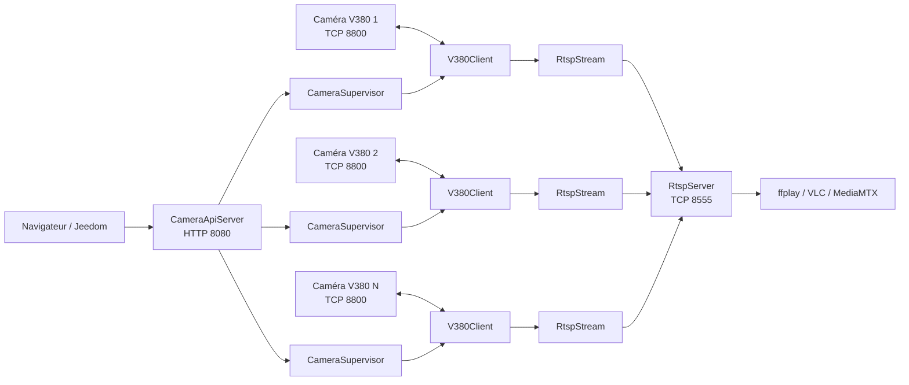

# Xiaovv / V380 — Serveur RTSP, API HTTP et pilotage multi-caméras

> Client Kotlin/JVM autonome pour caméras Xiaovv / V380 utilisant le protocole natif TCP de la caméra, avec déchiffrement H.265, publication RTSP, reconnexion automatique, PTZ, éclairage, modes d’image et API HTTP protégée par jeton.

---

## Sommaire

- [Objectif](#objectif)
- [Fonctions disponibles](#fonctions-disponibles)
- [Architecture](#architecture)
- [Rôle des classes](#rôle-des-classes)
- [Configuration](#configuration)
- [Secrets et variables d’environnement](#secrets-et-variables-denvironnement)
- [Ajouter une caméra](#ajouter-une-caméra)
- [RTSP](#rtsp)
- [API HTTP](#api-http)
- [Référence complète des routes](#référence-complète-des-routes)
- [Exemples curl / PowerShell](#exemples-curl--powershell)
- [Interface Web](#interface-web)
- [Reconnexion](#reconnexion)
- [Détails du protocole V380](#détails-du-protocole-v380)
- [Pipeline H.265 → RTP → RTSP](#pipeline-h265--rtp--rtsp)
- [Intégration Jeedom](#intégration-jeedom)
- [Sécurité](#sécurité)
- [Dépannage](#dépannage)
- [Limites actuelles](#limites-actuelles)
- [Évolutions possibles](#évolutions-possibles)

---

# Objectif

Ce projet permet d’exploiter des caméras **Xiaovv / V380 directement sur le réseau local**, sans dépendre de l’application mobile pour les fonctions déjà implémentées.

Le programme :

- se connecte directement à chaque caméra sur le port TCP natif ;
- réalise l’authentification V380 ;
- ouvre la session vidéo ;
- reconstruit et déchiffre les trames H.265 ;
- republie chaque caméra sous forme d’un flux RTSP ;
- expose une API HTTP de pilotage ;
- fournit une interface Web ;
- reconnecte automatiquement chaque caméra indépendamment des autres.

Le fonctionnement est **multi-caméras dynamique** : ajouter une caméra dans la configuration suffit. Il n’y a pas de limite de caméras.

---

# Fonctions disponibles

## Vidéo

- Connexion native V380 sur TCP `8800`.
- Authentification V380 moderne.
- Protocole v31 validé sur le matériel testé.
- Ouverture de la session vidéo.
- Réception du flux H.265.
- Reconstruction des frames fragmentées.
- Déchiffrement du média V380.
- Analyse Annex-B / NAL H.265.
- Détection VPS / SPS / PPS.
- Détection des keyframes.
- Packetisation RTP H.265.
- Serveur RTSP intégré.
- RTP interleaved sur RTSP/TCP.
- Plusieurs chemins RTSP simultanés.
- Reconnexion indépendante de chaque caméra.

## Pilotage

- PTZ haut.
- PTZ bas.
- PTZ gauche.
- PTZ droite.
- PTZ stop.
- Lumière ON.
- Lumière OFF.
- Lumière AUTO.
- Image couleur.
- Image noir et blanc / IR.
- Image automatique.
- Retournement de l’image à 180°.

## API / Web

- API HTTP intégrée.
- Authentification par jeton.
- Header `X-API-Token`.
- `Authorization: Bearer`.
- Liste dynamique des caméras.
- Statut connecté / hors ligne.
- Interface Web de pilotage.
- CORS activé.
- Adresse et port configurables.

---

# Architecture



Chaque caméra possède son propre :

- `CameraSupervisor` ;
- `V380Client` ;
- état de connexion ;
- cycle de reconnexion ;
- `RtspStream`.

Une caméra hors ligne ne doit donc pas interrompre les autres.

---

# Rôle des classes

## `Main.kt`

Point d’entrée de l’application.

Il :

- charge `AppConfig` ;
- crée `RtspServer` ;
- crée un `RtspStream` par caméra ;
- crée un `CameraSupervisor` par caméra ;
- crée `CameraApiServer` ;
- démarre les composants ;
- installe le shutdown hook ;
- assure l’arrêt propre.

## `AppConfig.kt`

Responsable de toute la configuration :

- `application.properties` ;
- fichier externe ;
- variables d’environnement ;
- découverte dynamique des IDs caméra ;
- validation des ports ;
- validation des noms de flux ;
- résolution des secrets ;
- configuration RTSP ;
- configuration API.

## `CameraSupervisor.kt`

Un superviseur par caméra.

Il :

- crée le `V380Client` ;
- connecte la caméra ;
- attache le `RtspStream` ;
- conserve le `currentClient` ;
- expose les commandes PTZ / lumière / image ;
- détecte les coupures ;
- ferme le client mort ;
- attend le délai configuré ;
- recrée un nouveau client.

Les commandes utilisent toujours le client actuellement actif. Après une reconnexion, l’API ne garde donc pas une ancienne socket.

## `CameraApiServer.kt`

Serveur HTTP intégré :

- sert l’interface Web ;
- contrôle le jeton ;
- route les requêtes ;
- retrouve la caméra par son ID ;
- appelle le `CameraSupervisor` ;
- renvoie du JSON et des codes HTTP explicites.

## `RtspStream.kt`

Représente le flux logique d’une caméra :

- reçoit les frames H.265 ;
- découpe les NAL Annex-B ;
- mémorise VPS / SPS / PPS ;
- détecte les keyframes ;
- construit les informations nécessaires au SDP ;
- notifie les clients RTSP.

## `RtspServer.kt`

Serveur RTSP multi-flux.

Méthodes prises en charge :

```text
OPTIONS
DESCRIBE
SETUP
PLAY
PAUSE
GET_PARAMETER
TEARDOWN
```

Le serveur :

- sélectionne le bon stream à partir du chemin RTSP ;
- construit le SDP ;
- attend une keyframe au démarrage d’un `PLAY` ;
- packetise H.265 en RTP ;
- envoie RTP sur la même socket TCP que RTSP.

## `V380Client.kt`

Client réseau natif d’une caméra :

- connexion AUTH ;
- authentification ;
- connexion STREAM ;
- login vidéo ;
- démarrage vidéo ;
- réception du flux ;
- commandes PTZ ;
- commandes lumière ;
- commandes image.

Toutes les écritures sur la socket STREAM sont synchronisées par un verrou pour éviter qu’une commande se mélange avec une autre écriture protocolaire.

## `V380Auth.kt`

Implémente l’authentification V380 moderne : paquet LOGIN, cryptographie AES, parsing de la réponse et récupération du ticket de session.

## `V380Protocol.kt`

Regroupe les constantes et structures du protocole : commandes, tailles, little-endian, login vidéo, start vidéo, stream init et résolutions.

## `V380MediaParser.kt`

Reconstruit une frame complète à partir de ses fragments réseau V380.

## `V380MediaDecoder.kt`

Déchiffre le contenu vidéo et produit une frame exploitable avec notamment : type, ID, timestamp, FPS, keyframe et payload H.265.

## `V380Stream.kt`

Boucle continue de réception média. Parse, décode puis notifie les listeners.

## `H265AnnexB.kt`

Analyse les NAL H.265 Annex-B : VPS 32, SPS 33, PPS 34, SEI 39/40 et types de keyframes HEVC.

## `H265RtpPacketizer.kt`

Transforme les NAL en RTP : payload type 96, horloge 90 kHz, SSRC, numéro de séquence, timestamp, NAL simples et fragmentation FU.

---
# Configuration

Le fichier embarqué est normalement :

```text
src/main/resources/application.properties
```

Exemple recommandé :

```properties
# ============================================================
# RTSP
# ============================================================
rtsp.bind-address=0.0.0.0
rtsp.port=8555

# ============================================================
# API HTTP
# ============================================================
api.bind-address=0.0.0.0
api.port=8080

# NOM de la variable d'environnement, pas le jeton lui-même
api.token-env=XIAOVV_API_TOKEN

# ============================================================
# CAMÉRA PARKING
# ============================================================
camera.parking.enabled=true
camera.parking.stream-name=parking
camera.parking.host=192.168.1.100
camera.parking.port=8800
camera.parking.device-id=XXXXXXXX
camera.parking.username=XXXXXXXX

# NOM de la variable d'environnement, pas le mot de passe
camera.parking.password-env=XIAOVV_CAMERA_PARKING_PASSWORD

camera.parking.resolution=high
camera.parking.reconnect-delay-ms=5000
```

## Paramètres globaux

| Paramètre | Défaut | Description |
|---|---:|---|
| `rtsp.bind-address` | `0.0.0.0` | Adresse d’écoute RTSP |
| `rtsp.port` | `8555` | Port RTSP |
| `api.bind-address` | `127.0.0.1` | Adresse d’écoute HTTP |
| `api.port` | `8080` | Port HTTP |
| `api.token-env` | `XIAOVV_API_TOKEN` | Nom de la variable contenant le jeton |
| `api.token` | aucun | Fallback en clair, déconseillé |

Pour rendre l’API accessible depuis le LAN :

```properties
api.bind-address=0.0.0.0
```

## Paramètres caméra

Format :

```text
camera.<id>.<propriété>
```

| Propriété | Obligatoire | Défaut | Description |
|---|---:|---|---|
| `enabled` | non | `true` | Active/désactive la caméra |
| `stream-name` | non | ID caméra | Nom du chemin RTSP |
| `host` | oui | — | IP / hostname caméra |
| `port` | non | `8800` | Port natif V380 |
| `device-id` | oui | — | Device ID |
| `username` | non | Device ID | Utilisateur |
| `password-env` | recommandé | — | Nom de variable contenant le mot de passe |
| `password` | non | — | Fallback en clair, déconseillé |
| `resolution` | non | `high` | `low`, `sd`, `high`, `hd` |
| `reconnect-delay-ms` | non | `5000` | Délai avant reconnexion |

Contraintes :

- ID caméra : lettres, chiffres, `_`, `-` ;
- stream-name : lettres, chiffres, `_`, `-` ;
- deux caméras ne peuvent pas avoir le même `stream-name` ;
- délai de reconnexion minimal : `1000 ms`.

## Fichier externe

Le fichier peut être sorti du JAR.

Propriété Java :

```text
-Dxiaovv.config=/chemin/application.properties
```

Variable d’environnement :

```text
XIAOVV_CONFIG=/chemin/application.properties
```

Ordre de priorité :

1. `-Dxiaovv.config` ;
2. `XIAOVV_CONFIG` ;
3. ressource `application.properties`.

---

# Secrets et variables d’environnement

## Important : `password-env` contient un NOM

Correct :

```properties
camera.parking.password-env=XIAOVV_CAMERA_PARKING_PASSWORD
```

Puis la variable contient le vrai secret :

```text
XIAOVV_CAMERA_PARKING_PASSWORD=<mot de passe réel>
```

Incorrect :

```properties
camera.parking.password-env=<mot de passe réel>
```

Même principe pour :

```properties
api.token-env=XIAOVV_API_TOKEN
```

## Variables globales

```text
XIAOVV_CONFIG
XIAOVV_RTSP_BIND
XIAOVV_RTSP_PORT
XIAOVV_API_BIND
XIAOVV_API_PORT
XIAOVV_API_TOKEN
```

## Variables par caméra

Format automatique :

```text
XIAOVV_CAMERA_<ID>_<PROPRIETE>
```

Pour `parking` :

```text
XIAOVV_CAMERA_PARKING_ENABLED
XIAOVV_CAMERA_PARKING_STREAM_NAME
XIAOVV_CAMERA_PARKING_HOST
XIAOVV_CAMERA_PARKING_PORT
XIAOVV_CAMERA_PARKING_DEVICE_ID
XIAOVV_CAMERA_PARKING_USERNAME
XIAOVV_CAMERA_PARKING_PASSWORD
XIAOVV_CAMERA_PARKING_RESOLUTION
XIAOVV_CAMERA_PARKING_RECONNECT_DELAY_MS
```

Les `-` deviennent `_` et les noms sont convertis en majuscules.

## Windows / PowerShell

```powershell
$env:XIAOVV_API_TOKEN="votre_jeton"
$env:XIAOVV_CAMERA_PARKING_PASSWORD="votre_mot_de_passe"
```

Générer un jeton :

```powershell
[guid]::NewGuid().ToString("N")
```

## Linux

```bash
export XIAOVV_API_TOKEN='votre_jeton'
export XIAOVV_CAMERA_PARKING_PASSWORD='votre_mot_de_passe'
```

## IntelliJ IDEA

```text
Run → Edit Configurations → Environment variables
```

---

# Ajouter une caméra

Aucune modification Kotlin n’est nécessaire.

```properties
camera.entree.enabled=true
camera.entree.stream-name=entree
camera.entree.host=192.168.1.110
camera.entree.port=8800
camera.entree.device-id=XXXXXXXX
camera.entree.username=XXXXXXXX
camera.entree.password-env=XIAOVV_CAMERA_ENTREE_PASSWORD
camera.entree.resolution=high
camera.entree.reconnect-delay-ms=5000
```

Définir ensuite :

```text
XIAOVV_CAMERA_ENTREE_PASSWORD
```

Au redémarrage, le programme crée automatiquement :

```text
RTSP : /entree
API  : /api/cameras/entree/...
Web  : une nouvelle carte caméra
```

La limite pratique dépend du réseau, du CPU, de la mémoire, du bitrate et du nombre de clients RTSP, pas d’un nombre de caméras codé en dur.

---

# RTSP

Format :

```text
rtsp://<IP_SERVEUR>:<PORT>/<stream-name>
```

Exemple :

```text
rtsp://192.168.1.20:8555/parking
```

## ffplay

```bash
ffplay -rtsp_transport tcp rtsp://192.168.1.20:8555/parking
```

Le transport TCP est important : le serveur actuel implémente **RTP interleaved sur RTSP/TCP**.

## Plusieurs flux

```text
rtsp://192.168.1.20:8555/parking
rtsp://192.168.1.20:8555/garage
rtsp://192.168.1.20:8555/jardin
rtsp://192.168.1.20:8555/entree
```

## Codec et RTP

```text
Codec        : H.265 / HEVC
Payload Type : 96
Horloge RTP  : 90000 Hz
MTU          : 1200
Track        : trackID=0
Transport    : RTSP/TCP interleaved
```

Le serveur ne transcode pas la vidéo en un autre codec. Il récupère le H.265 de la caméra et le transforme en RTP.

Le SDP peut inclure :

```text
sprop-vps
sprop-sps
sprop-pps
```

Lors d’un `PLAY`, le serveur attend une keyframe avant d’envoyer la vidéo afin de ne pas démarrer au milieu d’un GOP.

---
# API HTTP

Base :

```text
http://<IP_SERVEUR>:<PORT_API>
```

Exemple :

```text
http://192.168.1.20:8080
```

Toutes les routes sous `/api/` exigent un jeton.

Deux formes sont acceptées :

```http
X-API-Token: VOTRE_JETON
```

ou :

```http
Authorization: Bearer VOTRE_JETON
```

Le jeton ne doit pas être placé dans l’URL.

---

# Référence complète des routes

## Interface Web

### `GET /`

Affiche l’interface de pilotage.

```http
GET /
```

La page elle-même ne contient pas de secret. Elle demande ensuite le jeton pour appeler `/api/...`.

## Liste des caméras

### `GET /api/cameras`

```http
GET /api/cameras
X-API-Token: VOTRE_JETON
```

Exemple :

```json
[
  {
    "id": "garage",
    "stream": "garage",
    "running": true,
    "connected": true
  },
  {
    "id": "parking",
    "stream": "parking",
    "running": true,
    "connected": true
  }
]
```

## État caméra

### `GET /api/cameras/{id}/status`

```http
GET /api/cameras/parking/status
X-API-Token: VOTRE_JETON
```

Réponse :

```json
{
  "id": "parking",
  "stream": "parking",
  "host": "192.168.1.100",
  "running": true,
  "connected": true
}
```

`running=true` signifie que le superviseur est actif.

`connected=true` signifie qu’un client possède actuellement une connexion STREAM exploitable.

Pendant une reconnexion, on peut donc avoir :

```json
{
  "running": true,
  "connected": false
}
```

## PTZ

| Action | Route recommandée |
|---|---|
| Haut | `POST /api/cameras/{id}/ptz/up` |
| Bas | `POST /api/cameras/{id}/ptz/down` |
| Gauche | `POST /api/cameras/{id}/ptz/left` |
| Droite | `POST /api/cameras/{id}/ptz/right` |
| Stop | `POST /api/cameras/{id}/ptz/stop` |

Exemple :

```http
POST /api/cameras/parking/ptz/left
X-API-Token: VOTRE_JETON
```

```json
{
  "success": true,
  "camera": "parking",
  "command": "ptz/left"
}
```

Une direction démarre le mouvement. Le client doit ensuite envoyer `ptz/stop`.

L’interface Web envoie automatiquement STOP au relâchement du bouton, à l’annulation du pointeur ou si la fenêtre perd le focus.

## Lumière

| Action | Route |
|---|---|
| ON | `POST /api/cameras/{id}/light/on` |
| OFF | `POST /api/cameras/{id}/light/off` |
| AUTO | `POST /api/cameras/{id}/light/auto` |

Exemple :

```http
POST /api/cameras/parking/light/auto
X-API-Token: VOTRE_JETON
```

## Image

| Action | Route |
|---|---|
| Couleur | `POST /api/cameras/{id}/image/color` |
| Noir & blanc / IR | `POST /api/cameras/{id}/image/bw` |
| Auto | `POST /api/cameras/{id}/image/auto` |
| Rotation 180° | `POST /api/cameras/{id}/image/flip` |

`image/flip` est un **basculement**, pas une affectation absolue. Un nouvel appel rebascule l’orientation.

## Tableau global

| Méthode | Route | Fonction |
|---|---|---|
| GET | `/` | Interface Web |
| GET | `/api/cameras` | Liste des caméras |
| GET | `/api/cameras/{id}/status` | État caméra |
| POST | `/api/cameras/{id}/ptz/up` | PTZ haut |
| POST | `/api/cameras/{id}/ptz/down` | PTZ bas |
| POST | `/api/cameras/{id}/ptz/left` | PTZ gauche |
| POST | `/api/cameras/{id}/ptz/right` | PTZ droite |
| POST | `/api/cameras/{id}/ptz/stop` | PTZ stop |
| POST | `/api/cameras/{id}/light/on` | Lumière ON |
| POST | `/api/cameras/{id}/light/off` | Lumière OFF |
| POST | `/api/cameras/{id}/light/auto` | Lumière AUTO |
| POST | `/api/cameras/{id}/image/color` | Couleur |
| POST | `/api/cameras/{id}/image/bw` | N&B / IR |
| POST | `/api/cameras/{id}/image/auto` | Image AUTO |
| POST | `/api/cameras/{id}/image/flip` | Rotation 180° |

Les routes de commande acceptent également `GET` dans l’implémentation actuelle pour faciliter les tests. **Utiliser POST dans une intégration normale.**

---

# Exemples curl / PowerShell

## Liste

```bash
curl -H "X-API-Token: $XIAOVV_API_TOKEN" \
  http://192.168.1.20:8080/api/cameras
```

## PTZ gauche puis stop

```bash
curl -X POST -H "X-API-Token: $XIAOVV_API_TOKEN" \
  http://192.168.1.20:8080/api/cameras/parking/ptz/left

curl -X POST -H "X-API-Token: $XIAOVV_API_TOKEN" \
  http://192.168.1.20:8080/api/cameras/parking/ptz/stop
```

## Bearer

```bash
curl -X POST \
  -H "Authorization: Bearer $XIAOVV_API_TOKEN" \
  http://192.168.1.20:8080/api/cameras/parking/light/on
```

## PowerShell

```powershell
$headers = @{
    "X-API-Token" = $env:XIAOVV_API_TOKEN
}

Invoke-RestMethod `
    -Method Post `
    -Uri "http://192.168.1.20:8080/api/cameras/parking/image/auto" `
    -Headers $headers
```

---

# Interface Web

URL :

```text
http://IP_SERVEUR:8080/
```

Chaque caméra est créée dynamiquement à partir de `GET /api/cameras`.

Présentation :

```text
parking
● Connectée

        ▲
    ◀ STOP ▶
        ▼

LUMIÈRE
ON   OFF   AUTO

MODE IMAGE
COULEUR   N&B / IR   AUTO   ↻ 180°
```

Le jeton est conservé dans `sessionStorage`, donc dans la session de l’onglet et pas en dur dans le HTML.

---

# Reconnexion

Chaque caméra possède sa propre boucle :

```text
connexion
  ↓
AUTH
  ↓
STREAM
  ↓
fonctionnement
  ↓
perte de connexion
  ↓
fermeture du client
  ↓
attente reconnect-delay-ms
  ↓
nouveau V380Client
  ↓
reconnexion
```

Exemple :

```text
[piscine] caméra indisponible : Connect timed out
[piscine] reconnexion dans 5000 ms
```

Ce message concerne uniquement `piscine`. Les autres caméras continuent à fonctionner.

---

# Détails du protocole V380

Cette section décrit le comportement actuellement implémenté et validé sur le matériel testé.

## Port natif

```text
TCP 8800
```

## Deux connexions successives

### Socket AUTH

1. ouverture TCP ;
2. envoi LOGIN ;
3. réception LOGIN_RESPONSE ;
4. récupération du ticket ;
5. fermeture de la socket AUTH.

### Socket STREAM

1. nouvelle connexion TCP au port 8800 ;
2. VIDEO_LOGIN ;
3. VIDEO_LOGIN_RESPONSE ;
4. START_VIDEO ;
5. STREAM_INIT ;
6. réception média ;
7. commandes de pilotage sur cette même socket.

## Authentification

LOGIN :

```text
Commande : 31167 / 0x79BF
Taille   : 520 octets
```

LOGIN_RESPONSE :

```text
Commande : 31168 / 0x79C0
Taille   : 256 octets
```

Codes observés :

```text
1001 = succès
1011 = utilisateur incorrect
1012 = mot de passe incorrect
1018 = problème Device ID
```

Version de protocole validée :

```text
31
```

L’authentification moderne utilise AES et un bloc d’authentification généré. Les secrets ne doivent jamais être loggés.

## Login vidéo

```text
VIDEO_LOGIN          : commande 301, 256 octets
VIDEO_LOGIN_RESPONSE : commande 401, 32 octets
Résultat attendu     : 1001
```

La réponse fournit largeur, hauteur et FPS.

## Résolutions observées

Sur les caméras testées :

```text
LOW  = 640 x 360 @ 20 fps
HIGH = 2304 x 1296 @ 20 fps
```

Les valeurs peuvent dépendre du modèle ou du firmware.

## Démarrage vidéo

```text
START_VIDEO : commande 303
attente     : ~150 ms
STREAM_INIT : commande 8449
```

## Fragments média

En-tête observé : 12 octets.

```text
offset 0 : magic
offset 1 : type
offset 2 : séquence
offset 3 : nombre total de fragments, uint16 LE
offset 5 : index du fragment
offset 7 : taille payload
offset 9 : réservé
```

Magic :

```text
0x7F
```

Types observés :

```text
0x28 = keyframe / I-frame
0x29 = frame suivante
0x5B = metadata / autre
```

`V380MediaParser` reconstitue la frame avant décodage.

---
# Pipeline H.265 → RTP → RTSP

```mermaid
flowchart LR
    A[Fragments V380] --> B[V380MediaParser]
    B --> C[V380MediaDecoder]
    C --> D[H.265 Annex-B]
    D --> E[H265AnnexB]
    E --> F[NAL Units]
    F --> G[RtspStream]
    G --> H[H265RtpPacketizer]
    H --> I[RTP H.265]
    I --> J[RTSP/TCP interleaved]
    J --> K[ffplay / VLC / MediaMTX]
```



## Déchiffrement média

Le flux média V380 n’est pas utilisable directement comme un fichier H.265 brut.

Le pipeline :

1. reconstruit les fragments ;
2. analyse le header interne ;
3. extrait le payload ;
4. reconstruit la clé de session à partir du ticket d’authentification et des constantes du protocole ;
5. déchiffre les blocs nécessaires ;
6. recherche le start code Annex-B ;
7. transmet le H.265 nettoyé.

## Analyse NAL

Le type HEVC est dérivé de :

```text
(byte >> 1) & 0x3F
```

Types particulièrement importants :

```text
32 = VPS
33 = SPS
34 = PPS
39 = SEI prefix
40 = SEI suffix
```

Les types de NAL correspondant aux keyframes sont également détectés.

## RTP

Chaque session RTSP dispose de son propre :

- SSRC ;
- numéro de séquence ;
- timestamp RTP.

Horloge :

```text
90000 Hz
```

Le timestamp caméra est utilisé pour faire progresser l’horloge lorsque sa variation est cohérente. En cas de discontinuité, un pas basé sur les FPS sert de repli.

### NAL petite

```text
NAL <= MTU
→ 1 paquet RTP
```

### NAL grande

```text
NAL > MTU
→ fragmentation FU HEVC
→ plusieurs paquets RTP
```

## RTSP interleaved

RTP et RTSP utilisent la même socket TCP.

Format :

```text
'$'
channel
uint16 longueur
paquet RTP
```

Valeurs typiques :

```text
canal 0 = RTP
canal 1 = RTCP
```

Les écritures sont synchronisées afin qu’un paquet RTP ne se mélange pas avec une réponse RTSP.

---

# Codes HTTP et réponses JSON

## 200 — succès

```json
{
  "success": true,
  "camera": "parking",
  "command": "light/on"
}
```

## 400 — commande invalide

```json
{
  "success": false,
  "error": "Direction PTZ inconnue : turbo"
}
```

## 401 — jeton absent ou incorrect

```json
{
  "success": false,
  "error": "unauthorized"
}
```

## 404 — caméra / route inconnue

```json
{
  "success": false,
  "error": "Caméra inconnue : inconnue"
}
```

## 405 — méthode HTTP non autorisée

```json
{
  "success": false,
  "error": "Méthode HTTP non autorisée"
}
```

## 503 — caméra hors ligne

```json
{
  "success": false,
  "camera": "parking",
  "error": "camera offline"
}
```

## 500 — erreur interne

```json
{
  "success": false,
  "error": "..."
}
```

---

# Intégration Jeedom

L’API est conçue pour être facilement appelée depuis Jeedom.

Pour une caméra `parking` :

## Info

```text
GET /api/cameras/parking/status
```

## Actions PTZ

```text
POST /api/cameras/parking/ptz/up
POST /api/cameras/parking/ptz/down
POST /api/cameras/parking/ptz/left
POST /api/cameras/parking/ptz/right
POST /api/cameras/parking/ptz/stop
```

## Actions lumière

```text
POST /api/cameras/parking/light/on
POST /api/cameras/parking/light/off
POST /api/cameras/parking/light/auto
```

## Actions image

```text
POST /api/cameras/parking/image/color
POST /api/cameras/parking/image/bw
POST /api/cameras/parking/image/auto
POST /api/cameras/parking/image/flip
```

Header obligatoire :

```text
X-API-Token: VOTRE_JETON
```

ou :

```text
Authorization: Bearer VOTRE_JETON
```

Un équipement Jeedom peut donc être représenté ainsi :

```text
Caméra Parking
├── Info : connecté
├── Haut
├── Bas
├── Gauche
├── Droite
├── Stop
├── Lumière ON
├── Lumière OFF
├── Lumière AUTO
├── Couleur
├── IR / N&B
├── Image AUTO
└── Rotation 180°
```

Flux vidéo associé :

```text
rtsp://IP_SERVEUR:8555/parking
```

---

# Sécurité

## API HTTP

Le jeton protège l’API mais le transport actuel est **HTTP**, pas HTTPS.

Le jeton n’est donc pas chiffré sur le réseau.

## RTSP

Le serveur RTSP actuel :

- ne chiffre pas le trafic ;
- n’implémente pas encore d’authentification RTSP.

## Recommandations

- Ne jamais rediriger directement le port 8080 depuis Internet.
- Ne jamais exposer directement 8555 sur Internet.
- Utiliser le service sur un LAN de confiance.
- Utiliser un VPN pour un accès distant.
- Idéalement isoler les caméras IoT dans un VLAN.
- Réserver leurs IP dans le DHCP.
- Stocker mots de passe et token dans des variables d’environnement.
- Ne jamais committer de secret dans Git.

Exemple `.gitignore` :

```gitignore
.env
.env.*
application-local.properties
secrets.properties
*.log
```

---

# Dépannage

## `Connect timed out`

```text
[piscine] caméra indisponible : Connect timed out
```

La connexion à :

```text
IP_CAMERA:8800
```

n’aboutit pas.

Vérifier :

1. caméra allumée ;
2. IP actuelle ;
3. réservation DHCP ;
4. port 8800 ;
5. firewall ;
6. routage / VLAN ;
7. isolation Wi-Fi / réseau invité.

Linux :

```bash
nc -vz 192.168.1.100 8800
```

ou :

```bash
nmap -p 8800 192.168.1.100
```

## Authentification 1012

Le mot de passe est incorrect.

Contrôler :

```text
XIAOVV_CAMERA_<ID>_PASSWORD
```

et vérifier que `password-env` contient bien le **nom de cette variable**.

## API 401

Contrôler le token et le header :

```text
X-API-Token
```

ou :

```text
Authorization: Bearer
```

## API 503

L’API tourne, mais la caméra n’a pas de connexion STREAM active.

Tester :

```text
GET /api/cameras/<id>/status
```

## Impossible d’ouvrir l’interface depuis un autre PC

Vérifier :

```properties
api.bind-address=0.0.0.0
```

puis le firewall du serveur.

## RTSP inaccessible depuis le LAN

Vérifier :

```properties
rtsp.bind-address=0.0.0.0
```

puis le firewall.

## `Address already in use`

Le port est occupé.

Changer par exemple :

```properties
api.port=8081
```

ou :

```properties
rtsp.port=8556
```

## RTSP 461 / `Unsupported Transport`

Le lecteur demande probablement UDP.

Forcer TCP :

```bash
ffplay -rtsp_transport tcp rtsp://IP:8555/parking
```

## Écran noir au démarrage du RTSP

Le serveur attend volontairement une keyframe avant de commencer l’envoi. Un petit délai est donc normal.

## PTZ part mais ne s’arrête pas

Toujours envoyer :

```text
/ptz/stop
```

Une intégration externe doit gérer elle-même le STOP après une commande de direction.

## Une caméra tombe mais les autres fonctionnent

Comportement normal : chaque caméra possède son propre superviseur et sa propre reconnexion.

---

# Logs

Les logs permettent d’identifier notamment :

- AUTH ;
- authentification ;
- version protocole ;
- connexion STREAM ;
- résolution annoncée ;
- démarrage média ;
- VPS / SPS / PPS ;
- connexions RTSP ;
- keyframes ;
- PTZ ;
- lumière ;
- modes image ;
- coupures ;
- reconnexions.

Exemples :

```text
[parking] caméra connectée : 2304x1296 @ 20 fps
```

```text
PTZ : DOWN
[parking] API PTZ DOWN
PTZ : STOP
[parking] API PTZ STOP
```

```text
[piscine] caméra indisponible : Connect timed out
[piscine] reconnexion dans 5000 ms
```

Les secrets ne doivent jamais apparaître dans les logs.

---

# Limites actuelles

Non implémenté ou non validé à ce stade :

- audio ;
- RTP/UDP ;
- authentification RTSP ;
- TLS / HTTPS intégré ;
- ONVIF ;
- zoom optique ;
- presets PTZ ;
- lecture de position PTZ ;
- retour d’état réel de la lumière ;
- retour d’état réel du mode image ;
- détection de mouvement ;
- détection humaine ;
- snapshots intégrés ;
- enregistrement intégré ;
- historique ;
- MediaMTX automatisé ;
- découverte automatique des caméras ;
- modification de configuration à chaud.

Le fait que certaines fonctions existent dans l’application V380 officielle ne signifie pas qu’elles sont déjà supportées ici.

---

# Évolutions possibles

- intégration Jeedom complète ;
- service `systemd` ;
- endpoint `/health` global ;
- uptime par caméra ;
- durée depuis la dernière frame ;
- compteurs FPS et bitrate ;
- compteur de reconnexions ;
- authentification RTSP ;
- MediaMTX ;
- HLS / WebRTC ;
- snapshots ;
- presets PTZ si le protocole est identifié ;
- événements de mouvement ;
- métriques Prometheus ;
- configuration à chaud ;
- OpenAPI / Swagger ;
- interface Web avancée.

---

# Résumé rapide

## Vidéo

```text
Caméra V380
    ↓ TCP 8800
V380Client
    ↓
V380MediaParser
    ↓
V380MediaDecoder
    ↓ H.265
RtspStream
    ↓
H265RtpPacketizer
    ↓ RTP
RtspServer
    ↓ RTSP/TCP
ffplay / VLC / MediaMTX
```

## Pilotage

```text
Navigateur / Jeedom
    ↓ HTTP + jeton
CameraApiServer
    ↓
CameraSupervisor
    ↓
V380Client
    ↓ socket STREAM existante
Caméra V380
```

## URLs essentielles

```text
Interface Web
http://IP_SERVEUR:8080/

Liste
GET http://IP_SERVEUR:8080/api/cameras

État
GET http://IP_SERVEUR:8080/api/cameras/parking/status

RTSP
rtsp://IP_SERVEUR:8555/parking

PTZ
POST /api/cameras/parking/ptz/up
POST /api/cameras/parking/ptz/down
POST /api/cameras/parking/ptz/left
POST /api/cameras/parking/ptz/right
POST /api/cameras/parking/ptz/stop

Lumière
POST /api/cameras/parking/light/on
POST /api/cameras/parking/light/off
POST /api/cameras/parking/light/auto

Image
POST /api/cameras/parking/image/color
POST /api/cameras/parking/image/bw
POST /api/cameras/parking/image/auto
POST /api/cameras/parking/image/flip
```

---

# Avertissement

Ce projet repose sur l’interopérabilité avec un protocole propriétaire Xiaovv / V380 et sur les comportements validés avec le matériel testé.

Des différences de firmware ou de modèle peuvent exister. Toujours valider une nouvelle commande sur une caméra avant de la généraliser à l’ensemble du parc.
