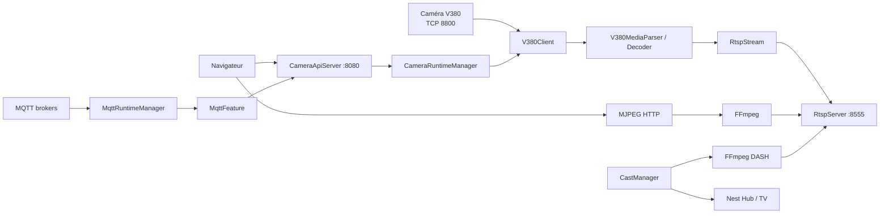

# Architecture Xiaovv

## Vue globale



## `Main.kt`

Assemble :

- `AppConfig` ;
- `RtspServer` ;
- `CameraRuntimeManager` ;
- `CastManager` ;
- `CameraApiServer`.

Le module MQTT est créé par `CameraApiServer` via `MqttFeature`.

## `CameraRuntimeManager`

Maintient les superviseurs actifs.

Lors d’un reload :

- caméras inchangées : conservées ;
- caméras modifiées : arrêtées puis recréées ;
- caméras ajoutées : créées ;
- caméras supprimées : fermées et stream RTSP retiré.

## `CameraSupervisor`

Un superviseur par caméra.

Il gère :

- activation à la demande ;
- connexion V380 ;
- reconnexion ;
- client courant ;
- commandes caméra ;
- disponibilité réseau.

La connexion média V380 n’est pas maintenue inutilement lorsqu’aucun consommateur RTSP ne demande la caméra.

## `V380Client`

Deux phases réseau principales :

```text
AUTH TCP
  ↓
ticket/session
  ↓
STREAM TCP
  ↓
vidéo + audio + commandes
```

## `RtspStream`

Stocke et distribue :

- VPS/SPS/PPS H.265 ;
- keyframes ;
- frames vidéo ;
- audio AAC ;
- snapshots.

## `RtspServer`

Serveur RTSP/TCP multi-stream.

Un `PLAY` augmente la demande du stream. Le dernier client qui part libère la demande.

## Mur Web

Le navigateur ne reçoit pas le H.265 directement.

```text
RTSP local
  ↓
FFmpeg
  ↓
MJPEG
  ↓
 navigateur
```

Chaque flux visible possède son process FFmpeg.

## Cast

```text
RTSP local
  ↓
FFmpeg H.264
  ↓
DASH/fMP4 temporaire
  ↓
HTTP /cast-media/<session>/...
  ↓
Google Cast
```

## MQTT

`MqttRuntimeManager` est un client MQTT 3.1.1 minimal sans dépendance MQTT externe.

Il conserve un cache :

```text
(broker, topic) -> dernière valeur + timestamp
```

Le dashboard interroge ce cache via l’API.

## Données serveur / navigateur

### Serveur

- configuration caméra ;
- configuration brokers MQTT ;
- état des caméras ;
- sessions Cast ;
- cache MQTT.

### Navigateur

- token API ;
- disposition ;
- boutons HTTP ;
- bulles MQTT ;
- ordre/tailles des éléments.
